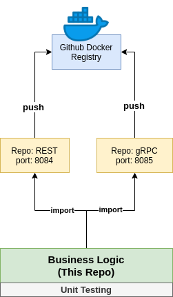
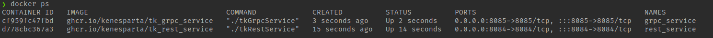

Business Logic for Multiply two numbers Service.

# 1. Related projects

This project has two related projects:

1. Rest: https://github.com/kenesparta/tk-rest-service
2. gRPC: https://github.com/kenesparta/tk-grpc-service



3. All those projects (Rest and gRPC) have a CI/CD (please see the *Actions* tab on each repository) that push to Github
Container registry (https://ghcr.io) and have **public access**.

4. To set up the project, run this (for now, there isn't a `docker-file.yaml`)
```shell
docker pull ghcr.io/kenesparta/tk_rest_service:latest
docker run --rm -d -p 8084:8084 --name rest_service ghcr.io/kenesparta/tk_rest_service

docker pull ghcr.io/kenesparta/tk_grpc_service:latest
docker run --rm -d -p 8085:8085 --name grpc_service ghcr.io/kenesparta/tk_grpc_service

```



# 2. Requirements

| Software         | Version | Importance                   |
| ---------------- | ------- | ---------------------------- |
| 🐳 Docker         | 20.10.9 | Required                     |
| 🐙 Docker Compose | 1.29.2  | Required                     |
| 🐃 GNU Make       | 4.2.1   | Optional                     |

# 3. Testing

I create a `multiply_test.go` to perform tests, to learn more see the file `Makefile`

## 3.1 Using your local machine

- Execute make `make l/test` to run the test.

## 3.1 Using Docker compose

- Execute `make d/test` or run:

```shell
docker run --rm -it -w /multiplyLogic -v $PWD/.:/multiplyLogic golang:1.17-alpine go test ./... -cover
```

> ⚠️ Warning ⚠️
>
> This command only works for UNIX-Like systems. On PowerShell make sure to replace the `$PWD` command with `%cd%`

# 4. CI/CD

The `.github` directory contains the pipelines to testing the code in these cases:

- When someone pushed on `main` branch.
- When someone sent a `Pull Request`. (Please see the Pull Request tab)
- When someone accepted the `Pull Request`.

# 5. How to use this into your project

Execute the command:

```shell
go get -u github.com/kenesparta/multiplyLogic
```
